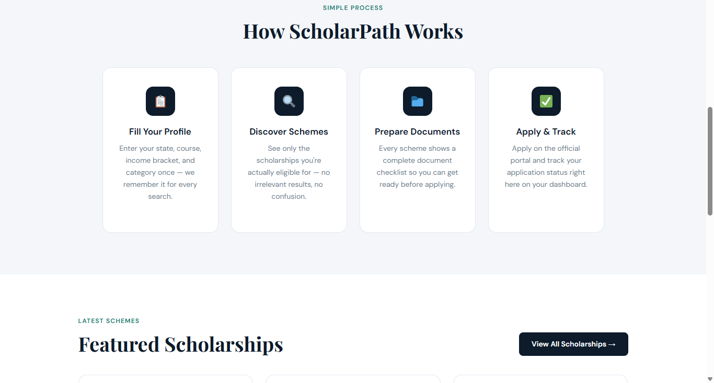
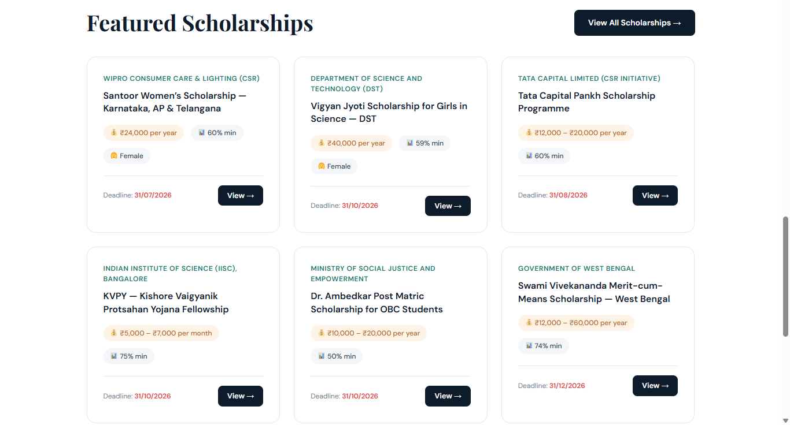
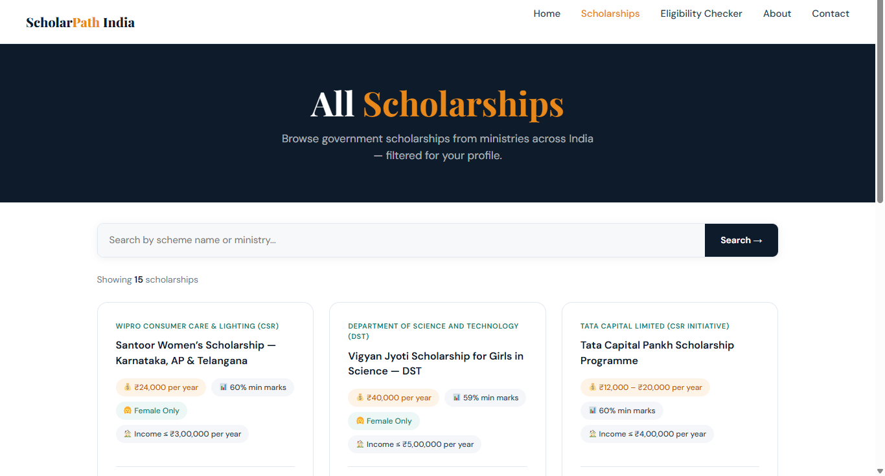
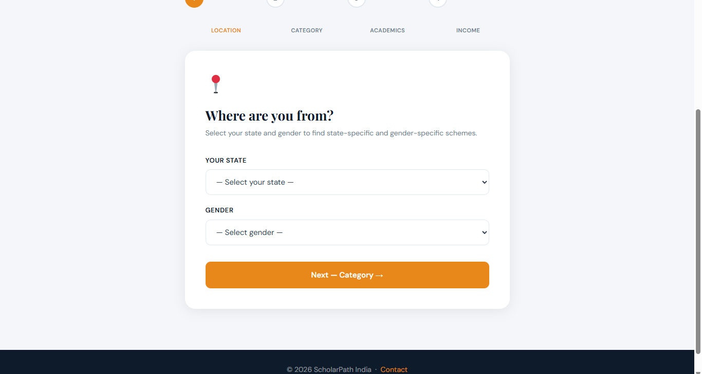

# ScholarPath India 🎓

A civic-tech scholarship discovery portal built to solve a real 
problem — over 60% of eligible Indian students never apply for 
government scholarships because information is scattered across 
50+ portals with no unified search.

## 🏠 Home Page

---

## 🏡 Home

---

## ✨ Home Features

---

## 🏁 Home End

---

## 🎓 Scholarship Page

---

## 🧮 Eligibility Checker Page

---

## 📋 Eligibility Checker

---

## ℹ️ About Page

---

## 📞 Contact Page

## 🌐 Live Demo
[localhost — deployment to Hostinger in progress]

## 🏗️ Tech Stack
- **CMS:** WordPress 6.9 with custom child theme
- **Languages:** PHP, HTML5, CSS3, JavaScript (Vanilla)
- **Plugins:** Advanced Custom Fields, CPT UI, WPForms, 
  Rank Math SEO, LiteSpeed Cache
- **Theme:** GeneratePress (parent) + custom child theme
- **Database:** MySQL via XAMPP (local) / cPanel (production)

## 📄 Pages Built
| Page | Description |
|------|-------------|
| Homepage | Hero, search, live scholarship cards, CTA |
| Scholarships | Full listing with search and count |
| Eligibility Checker | 4-step multi-form wizard with live matching |
| Scholarship Detail | Full detail with checklist, how-to-apply, apply button |
| About | Mission, stats, problem statement, values |
| Contact | Two-column layout with form + FAQ |

## 🔧 Custom WordPress Architecture

https://github.com/user-attachments/assets/67a7635c-8a4f-41c3-bb8c-874763f5743c

- **Custom Taxonomies** — `scheme_state`, `scheme_category`
- **ACF Field Group** — 9 fields per scholarship (amount, deadline, 
  ministry, eligible category, gender, marks, income, documents, URL)
- **Template Hierarchy** — custom `front-page.php`, 
  `page-scholarships.php`, `single-scholarship.php` and more
- **Child Theme** — full child theme with `functions.php`, 
  custom CSS variables, and GeneratePress filter hooks

## ✨ Key Features
- 🔍 Live scholarship search
- 🧮 Eligibility checker — 4-step form matching against real DB
- ✅ Interactive document checklist (click to mark collected)
- 📅 Deadline countdown display
- 📱 Fully responsive, mobile-first design
- 🎨 Custom design system (navy + saffron + teal palette)

https://github.com/user-attachments/assets/527f1d26-87d8-4997-9362-0d2480605137

